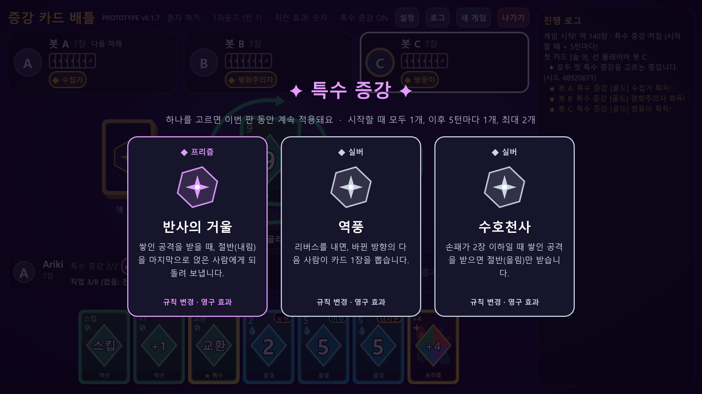
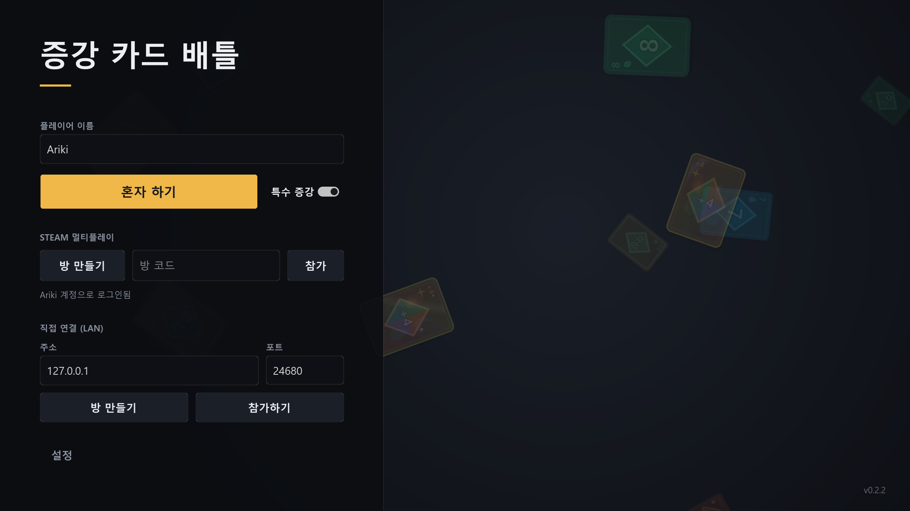
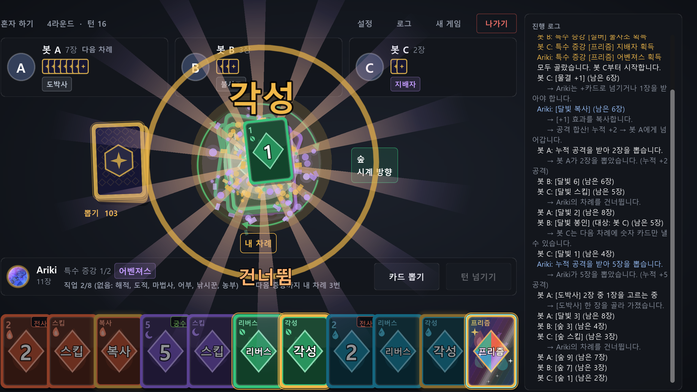
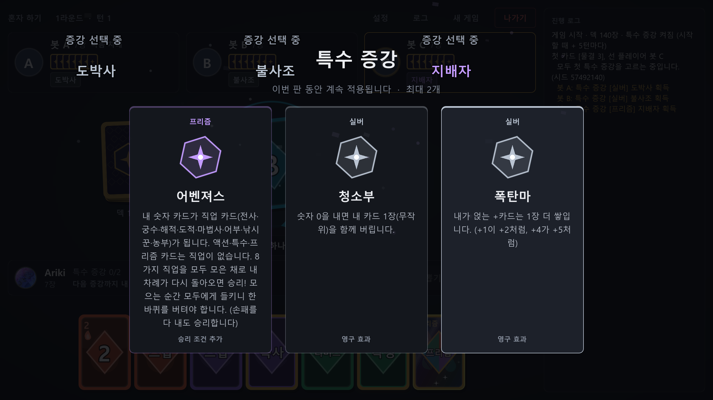
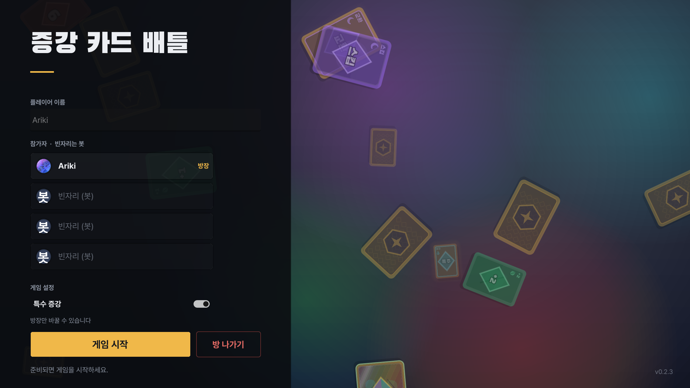

# 증강 카드 배틀 (Augment Card Battle)

> 우노처럼 손패를 먼저 다 내면 이기는 카드 게임에, **롤 증강처럼 판의 규칙 자체를 바꾸는 "특수 증강"** 을 더한 멀티플레이 카드 게임입니다.

- 엔진: **Godot 4.7 (.NET / C#)**
- 멀티플레이: **Steam P2P (포트포워딩 없음)** + ENet(IP 직접 연결)
- 배포: **itch.io** (itch 앱 자동 업데이트) — https://hamark.itch.io/sp-cardgame
- 개발 기간: 2026.09 ~ (프로토타입 v0.1.9)



## 주요 기능

| 분류 | 내용 |
|---|---|
| 카드 | 4문양(불꽃·달빛·숲·물결) + 프리즘, 숫자·스킵·리버스·**+1/+2/+3/+4**, 특수 카드(교환·봉인·복사·폭주), 각성 카드 — 총 140장 |
| +카드 합산 | 같은 + 숫자끼리는 문양 상관없이 얹어서 다음 사람에게 넘김. 프리즘 +4는 어떤 +카드와도 합산 |
| 직접 뽑기 | 공격을 받으면 시스템이 자동으로 뽑지 않고, **당한 사람이 직접 한 장씩 뽑기** (손맛) |
| 각성 | 각성 카드를 내면 10가지 능력 중 3개가 나오고 하나를 골라 즉시 발동 |
| 특수 증강 | 24종 (실버 12 · 골드 8 · 프리즘 4). 시작할 때 모두 동시에 1개, 6번째 차례에 1개 더 |
| 다른 승리 조건 | 어벤져스(직업 8종 모으기), 블랙홀(손패 28장), 수집가(같은 숫자 4문양) |
| 순위전 | 1등이 나와도 남은 사람끼리 계속해서 2·3·4등을 가림. 손패 30장이 되면 탈락(꼴찌) |
| 멀티 | Steam 로비 + 방 코드, 게임 끝나도 유지되는 대기방, 방장 강퇴·설정, 게임 안 친구 초대, 중간에 나가면 봇이 대신 플레이, Steam 프로필 사진 아바타 (움직이는 GIF 아바타도 재생) |
| 연출·사운드 | 화면 흔들림·번쩍임·빛줄기·파티클·카드 날아가기, 코드로 합성한 효과음 20종, 배경음악 |
| 설정 | 화면 모드·해상도, 전체/효과음/배경음악 볼륨 |

## 스크린샷

| 메인 화면 | 각성 연출 |
|---|---|
|  |  |
| **특수 증강 선택** | **대기방** |
|  |  |

## 구조

```
scripts/
├─ Core/         게임 규칙 (Godot 의존 없음 — 콘솔 테스트·봇 시뮬레이션·멀티 서버에서 그대로 사용)
│  ├─ GameEngine.cs   유일한 상태 변경 진입점 (Apply)
│  ├─ GameState.cs    상태 + 플레이어별 PlayerView (남의 손패는 장수만)
│  ├─ Rules.cs        낼 수 있는지 판정, +카드 합산 규칙
│  ├─ Augments.cs     특수 증강 24종 정의·뽑기
│  └─ Abilities.cs    각성 능력 10종
├─ AI/           랜덤봇, 규칙봇 (PlayerView만 보고 판단)
├─ Simulation/   봇끼리 수천 판 자동 대전 → 밸런스 측정
├─ Net/          HostSession(서버 권한) / ClientSession, ENet·Steam 전송 계층, 대기방
├─ UI/           화면 (전부 코드로 생성·벡터 드로잉), 연출(FxLayer), 설정
├─ Audio/        효과음 합성(SfxSynth), 배경음악
├─ Util/         GIF 디코더 (Steam 움직이는 아바타 재생용)
└─ Debug/        UI 스냅샷, 2인 네트워크 자동 테스트
```

- **서버 권한 구조**: 규칙 판정은 호스트의 `GameEngine`만 합니다. 클라이언트는 행동(`PlayerAction`)만 보내고, 자기 시점의 `PlayerView`만 받습니다.
- **밸런스는 시뮬레이션으로**: 증강을 추가·수정할 때마다 봇 대전 수천 판을 돌려서 증강별 승률을 20~30% 안에 맞췄습니다.

## 다운로드
 https://hamark.itch.io/sp-cardgame

> 개발 중에는 Valve 테스트 앱 ID `480`을 사용합니다.

## 크레딧

- 배경음악: "Backbay Lounge" Kevin MacLeod (incompetech.com) · Licensed under [CC BY 4.0](https://creativecommons.org/licenses/by/4.0/)
- 효과음: 코드로 직접 합성 (`scripts/Audio/SfxSynth.cs`)
- [Steamworks.NET](https://github.com/rlabrecque/Steamworks.NET) (MIT)
